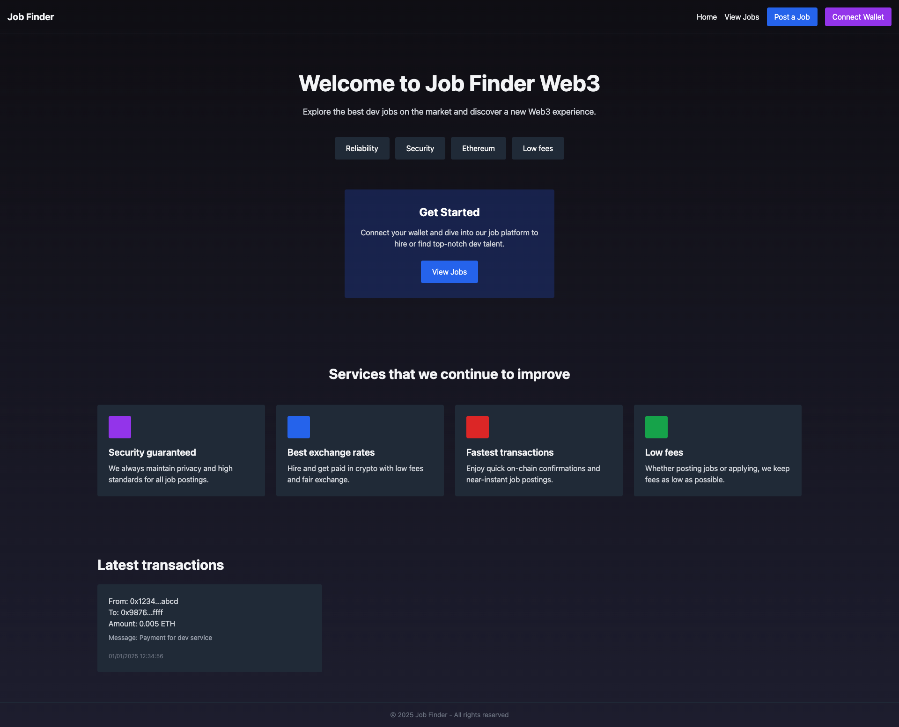

# Job Finder — Web3

Discover top developer jobs and explore **Web3** capabilities. Built using **Node.js**, **Express**, **SQLite**, **Sequelize**, and **Tailwind CSS**. Connect your wallet (via Metamask) and take advantage of potential crypto payments or blockchain integrations.

[View Demo](#) • [Report Bug](#) • [Request Feature](#)

---

## About The Project

A **minimalistic dark** job portal focusing on **Web3** roles (Solidity, Full Stack, Smart Contracts, etc.). Companies can post their open positions, and developers can search for Web3 opportunities. We also integrate a **Connect Wallet** feature using Metamask for potential on-chain transactions and advanced blockchain interactions in the future.



### Key Features

- **Home Page**: A sleek hero section with call-to-action, “services” cards, and a “latest transactions” section.
- **View Jobs**: Search for open positions, filter by keywords, and see detailed info about each job.
- **Post a Job**: Easily create new job listings with salary in both USD and BTC.
- **Connect Wallet**: Allows users to connect via Metamask, opening the door for on-chain payments or advanced Web3 functionalities.
- **Dark Themed UI**: Built with Tailwind CSS for a modern, minimal design.

---

## Built With

- **[Node.js](https://nodejs.org/en/)**
- **[Express](https://expressjs.com/)**
- **[SQLite](https://www.sqlite.org/index.html)** (via [Sequelize](https://sequelize.org/))
- **[Tailwind CSS](https://tailwindcss.com/)**
- **[Handlebars](https://handlebarsjs.com/)**
- Metamask (for wallet connections)

---

## Getting Started

To get a local copy up and running, follow these simple steps:

1. **Clone the repo**
   ```bash
   git clone https://github.com/your-username/job-finder-web3.git
   cd job-finder-web3

2. **Install Dependencies**
   ```bash
    npm install

3.	**Configure your database**
By default, we use a local SQLite file (app.db). Check db/connection.js if you want to adjust the path or switch DBs.

4.	**Seed the database (optional, if you want demo Web3 jobs)**
    ```bash
    node seed.js

5.	**Run the development server**
    ```bash
    npm run dev

or
    ```bash
    node app.js

- Open your browser at http://localhost:3000 to see it in action.

---

## Usage

1.	**Home Page**
A dark-themed landing page explaining the project, services, and showcasing Web3 integration.

2.	**View Jobs**
Access the /jobs route to see all posted Web3 positions. Use the search box to filter by job title.

3.	**Post a Job**
Go to /jobs/add and fill out the form to create a new Web3-related position, including salary in USD/BTC.

4.	**Connect Wallet**
Click the “Connect Wallet” button (navbar). If you have Metamask installed, it will prompt you to connect.

5.	**View Job Details**
Each job’s “View job” button shows a detailed page, including an email for contact (pablo@dev.com by default).

---

**Contributing**

- Contributions make open source such a great place to learn and create! Any contributions you make are truly appreciated.

	1.	Fork the Project
	2.	Create your Feature Branch ```(git checkout -b feature/AmazingFeature)```
	3.	Commit your Changes ```(git commit -m 'Add some AmazingFeature')```
	4.	Push to the Branch ```(git push origin feature/AmazingFeature)```
	5.	Open a Pull Request

---

**License**

Distributed under the MIT License. See LICENSE for more information.
